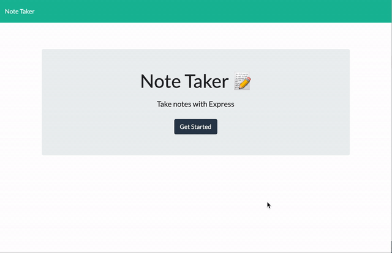

# Note_Taker
[See the app](https://young-wave-66962.herokuapp.com/)

Basic app to store notes. It gives you the option to write as many new notes as wanted, and delete them. 

# Technologies Used

1. Node.js
2. HTML, CSS, Bootstrap
2. NPM
3. ES6
4. Express

# Table of Contents

* [Installation](#installation)
* [Instructions](#instructions)
* [Example Gif](#example-gif)
* [Author](#author)

## Installation
> 1.npm init // 2.npm install

## Instructions
> Open your terminal and go inside the repo where the server.js is located. In your terminal type node server.js or nodemon server.js if already installed. Click on the Note title and note text placeholders to start writing your note. Click on the save icon to save it. Click on the note title to read your note and on the delete icon to delete it. If your note is being displayed, click the pen icon to go back to input a new note.

### Example Gif

## Author 

**MikelTafalla**

Email: mikel362d@gmail.com

Location: Santa Barbara

GitHub: https://github.com/MikelTafalla
